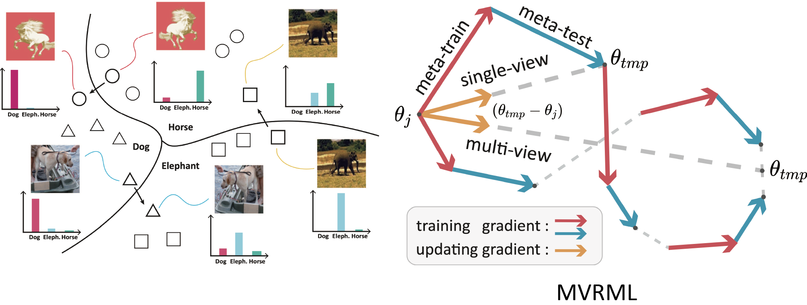

## Introduction


The implementation of ECCV 2022 paper [MVDG: A Unified Multi-view Framework for Domain Generalization](https://arxiv.org/abs/2112.12329).



 

## Install packages
pytorch version >= 1.8， otherwise, some errors may occur.

```bash
conda install pytorch torchvision cudatoolkit
conda install matplotlib tqdm tensorboardX
```


## Run the code
The core part of our method can be found in


There are two implementations of MVRML: a vanilla version and a paralleled version. The paralleled version could train faster but requires more GPUs (same as the number trajectories).


To run MVRML, you could run the following code. The `--data-root` argument needs to be changed according to your folder.


```bash
bash script/mvrml.sh
```


After the model has been trained, MVP could be applied to the trained model with the following code:


```bash
bash script/MVP.sh
```
